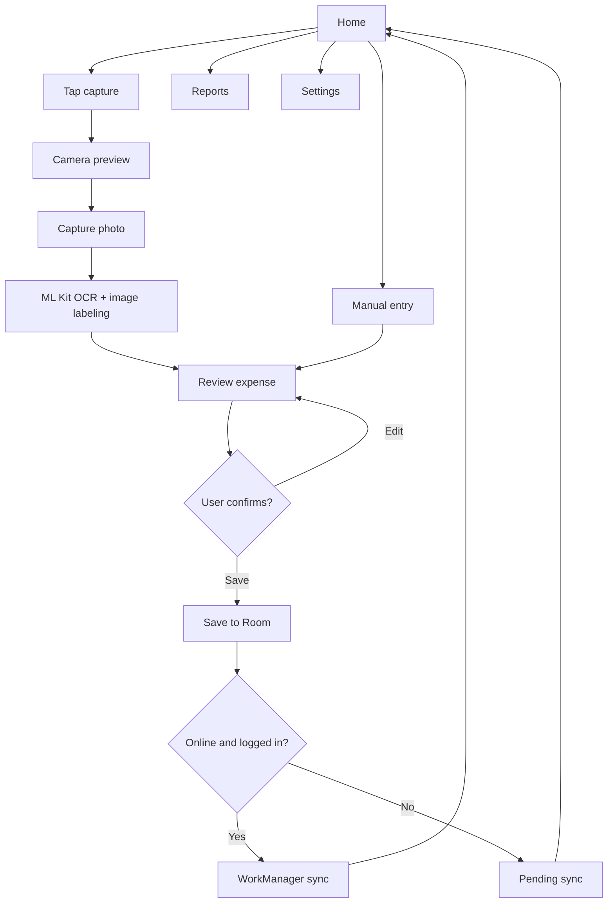

# Workflow

## Reference Workflow From Videos

Frame contact sheets:

- `research/frames/cap_money_1_contact_sheet.jpg`
- `research/frames/misa_1_contact_sheet.jpg`
- `research/frames/misa_2_contact_sheet.jpg`

## Cap money Flow Notes

1. Setup: user enters name and picks currency.
2. Home: calendar view, wallet chips, expense/income summary, floating add action.
3. Camera entry: camera preview with amount overlay, category selector, wallet selector, date picker, and confirm button.
4. Review/report: weekly/monthly review, category summaries, and charts.
5. Advanced: budgets, wallets/accounts, split bill, recurring transactions, language/currency settings, subscription screens.

## MISA Flow Notes

1. Onboarding: scan bill, voice AI, quick reports.
2. Auth: email/password, Google login.
3. Expense entry: amount field, transaction type, category grid, wallet, date, note, save.
4. Reports: chart, monthly filters, transaction details.
5. Management: dynamic categories, wallets, bank/debt modules, reminders, settings, language.

## Proposed App Flow

## Screen List

- Home:
  - Current month total.
  - Recent expenses.
  - Pending sync indicator.
  - Capture button and manual entry action.
- Camera:
  - Camera preview.
  - Capture, close, retake behavior.
  - Permission denied state.
- Review Expense:
  - Amount, title, category, wallet, date, note.
  - OCR confidence/status.
  - Save button.
- Reports:
  - Monthly total by category.
  - Simple category bars.
- Settings:
  - Language selector.
  - Backend URL note/config.
  - Login/sync status.

## Out Of Scope For V1

- Voice AI entry.
- Bank connection.
- Loans/debt and reminders.
- Split bills.
- Recurring transactions.
- Premium subscription.
- Chatbot.
